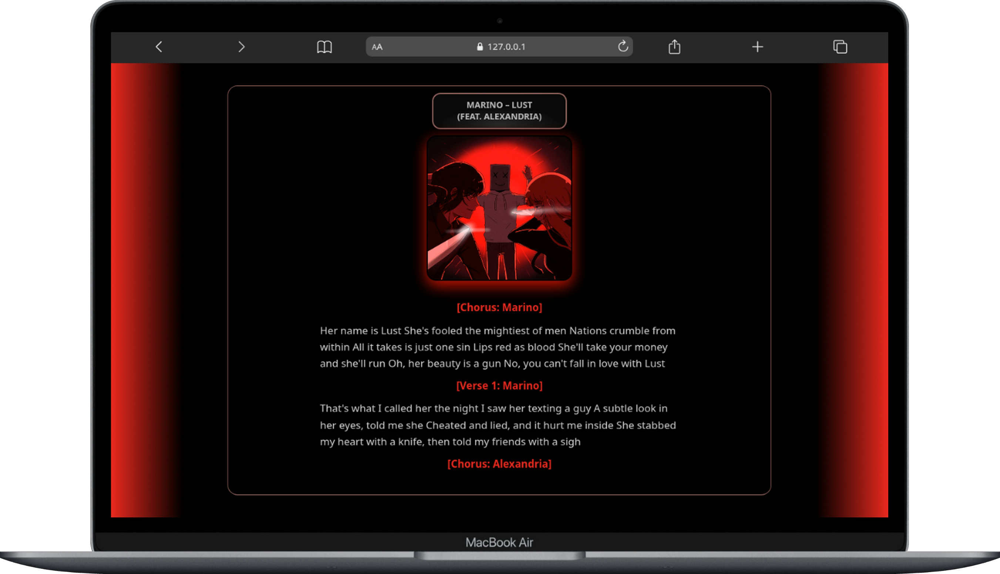
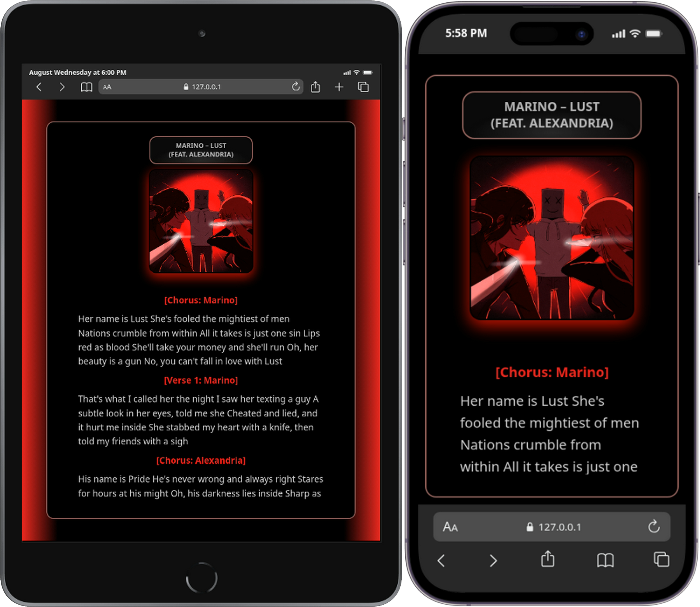

# 🎵 Lyric-Site

> A minimal, responsive lyric display page for the track **"Lust"** by *Marino (feat. Alexandria)* — built with pure HTML & CSS.

[](https://dani-devlop.github.io/Lyric-Site/)
[](./LICENCE)
[](https://developer.mozilla.org/)

---

## 📸 Preview

<p align="center">
  
  <br>
  
</p>

---

## ✨ Features

- 🎨 **Dark & immersive UI** – Deep black background with subtle red accents, optimized for lyric reading.
- 📱 **Fully responsive** – Looks perfect on desktops, tablets, and phones.
- 🖼️ **Album art placeholder** – Styled with a soft glow effect that complements the dark theme.
- 🧹 **Clean typography** – Carefully chosen spacing, font sizes, and section highlights for effortless reading.
- ⚡ **Zero dependencies** – No JavaScript, no external libraries – just fast, lightweight HTML/CSS.
- 🚀 **GitHub Pages ready** – Includes a GitHub Actions workflow for automatic deployment.

---

## 🛠️ Tech Stack

| Layer       | Technology                          |
|-------------|-------------------------------------|
| Markup      | HTML5                               |
| Styling     | CSS3 (Flexbox, custom properties)   |
| Deployment  | GitHub Actions + GitHub Pages       |
| Versioning  | Git                                 |

---

## 📂 Project Structure

```
Lyric-Site/
├── index.html                 # Main lyric page
├── Static/
│   ├── Css/
│   │   └── Style.css          # All styles
│   ├── Image/
│   │   └── cover.jpg          # Album cover image
│   └── Screenshot/            # Preview images (for README)
├── .github/
│   └── workflows/
│       └── static.yml         # GitHub Actions deployment workflow
├── LICENCE                    # MIT License
└── README.md                  # This file
```

---

## 🚀 Getting Started

### Prerequisites

- A modern web browser (Chrome, Firefox, Safari, Edge)
- (Optional) A local HTTP server for development

### Local Development

1. **Clone the repository**
   ```bash
   git clone https://github.com/Dani-Devlop/Lyric-Site.git
   cd Lyric-Site
   ```

2. **Open the page**
   - Double-click `index.html` in your file explorer, **or**
   - Serve it with any local server (VS Code Live Server, Python's `http.server`, etc.)

3. **Customize**
   - Edit `index.html` to change lyrics or structure.
   - Tweak styles in `Static/Css/Style.css`.
   - Replace `Static/Image/cover.jpg` with your own album art.

---

## 🎨 Design System

| CSS Variable            | Value                         | Usage                              |
|-------------------------|-------------------------------|------------------------------------|
| `--background-color`    | `#000000`                     | Page background                    |
| `--text-color`          | `oklch(0.85 0 0)`             | Primary text color                 |
| `--border-color`        | `rgba(196, 127, 127, 0.74)`   | Accent borders                     |
| `--cover-shadow-color`  | `rgba(255, 0, 0, 0.74)`       | Glow effect on album art           |
| `--scrollbar-color`     | `#db1520`                     | Custom scrollbar thumb             |

The layout uses **Flexbox** for centering and **radial gradients** to add depth, keeping the focus on the lyrics.

---

## 📱 Responsive Breakpoints

| Breakpoint      | Devices                         |
|-----------------|---------------------------------|
| `≤ 600px`       | Smartphones (portrait)          |
| `601px – 991px` | Tablets & small laptops         |
| `≥ 992px`       | Desktops & large screens        |

---

## 🌐 Deployment

This project is automatically deployed to **GitHub Pages** via GitHub Actions.

- Every push to the `main` branch triggers the `static.yml` workflow.
- The site is built and published to `https://dani-devlop.github.io/Lyric-Site/`.

To deploy manually, enable GitHub Pages in your repository settings and select the `main` branch as the source.

---

## 🤝 Contributing

Contributions are welcome! If you'd like to improve the design, add new features, or fix bugs:

1. **Fork** the repository.
2. **Create a feature branch** (`git checkout -b feature/your-idea`).
3. **Commit your changes** (`git commit -m 'Add some amazing feature'`).
4. **Push** to the branch (`git push origin feature/your-idea`).
5. **Open a Pull Request** against the `main` branch.

Please ensure your changes are well-tested and maintain the existing style consistency.

---

## 📄 License

This project is open‑source and available under the [MIT License](./LICENCE).

---

## 🙏 Acknowledgements

- **Marino & Alexandria** – for the powerful lyrics.
- **GitHub Pages** – for free static hosting.
- **All contributors and users** – your feedback is invaluable.

---

## 📬 Contact

**Developer:** [Dani-Devlop](https://github.com/Dani-Devlop)  
**Project Link:** [https://github.com/Dani-Devlop/Lyric-Site](https://github.com/Dani-Devlop/Lyric-Site)

---

<p align="center">Made with ❤️ for the love of music and code.</p>
